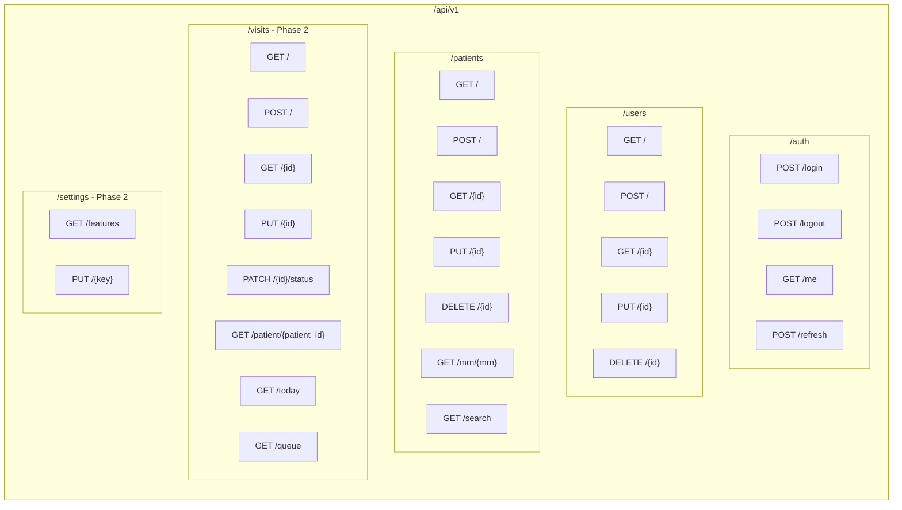
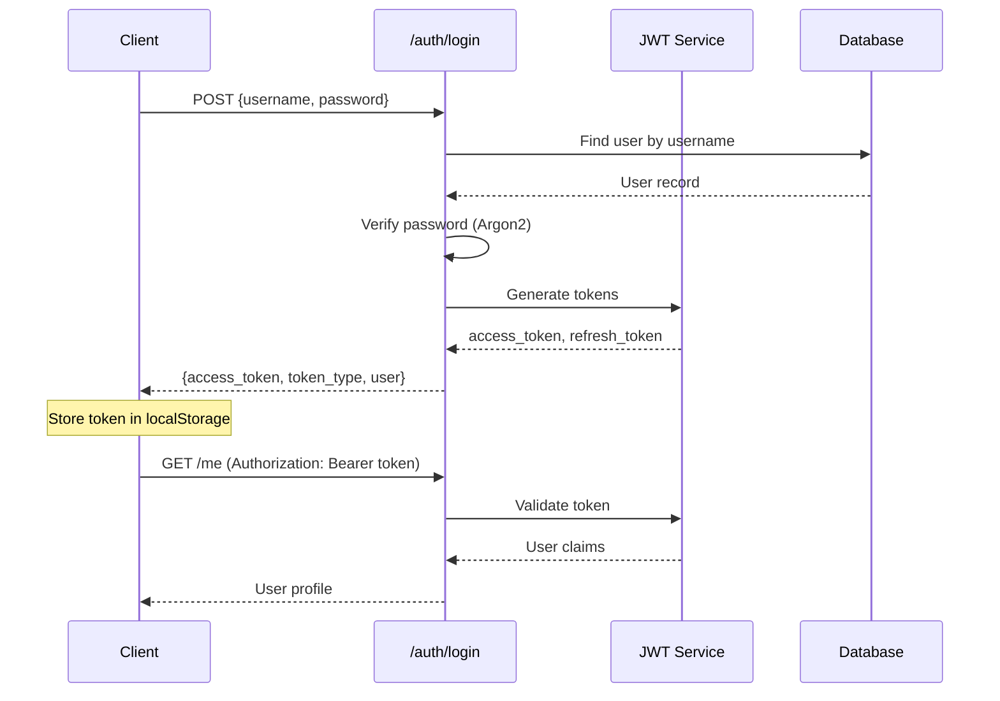

# EHR Application - API Endpoints Overview

## API Structure



## Endpoint Details

### Authentication (`/api/v1/auth`)

| Method | Endpoint | Description | Auth | Phase |
|--------|----------|-------------|------|-------|
| POST | `/login` | User login, returns JWT | ❌ | 1C |
| POST | `/logout` | Invalidate token | ✅ | 1C |
| GET | `/me` | Get current user info | ✅ | 1C |
| POST | `/refresh` | Refresh access token | ✅ | 1C |

### Users (`/api/v1/users`)

| Method | Endpoint | Description | Auth | Role | Phase |
|--------|----------|-------------|------|------|-------|
| GET | `/` | List all users | ✅ | Admin | 1C |
| POST | `/` | Create new user | ✅ | Admin | 1C |
| GET | `/{id}` | Get user by ID | ✅ | Admin | 1C |
| PUT | `/{id}` | Update user | ✅ | Admin | 1C |
| DELETE | `/{id}` | Deactivate user | ✅ | Admin | 1C |

### Patients (`/api/v1/patients`)

| Method | Endpoint | Description | Auth | Phase |
|--------|----------|-------------|------|-------|
| GET | `/` | List patients (paginated) | ✅ | 1D |
| POST | `/` | Create new patient | ✅ | 1D |
| GET | `/{id}` | Get patient by ID | ✅ | 1D |
| PUT | `/{id}` | Update patient | ✅ | 1D |
| DELETE | `/{id}` | Soft delete patient | ✅ | 1D |
| GET | `/mrn/{mrn}` | Get patient by MRN | ✅ | 1D |
| GET | `/search` | Search patients | ✅ | 1D |

### Visits (`/api/v1/visits`) - Phase 2

| Method | Endpoint | Description | Auth | Phase |
|--------|----------|-------------|------|-------|
| GET | `/` | List visits (filtered) | ✅ | 2B |
| POST | `/` | Create new visit | ✅ | 2B |
| GET | `/{id}` | Get visit by ID | ✅ | 2B |
| PUT | `/{id}` | Update visit | ✅ | 2B |
| PATCH | `/{id}/status` | Update status only | ✅ | 2B |
| DELETE | `/{id}` | Cancel visit | ✅ | 2B |
| GET | `/patient/{patient_id}` | Patient visit history | ✅ | 2B |
| GET | `/today` | Today's visits | ✅ | 2B |
| GET | `/queue` | Queue by status | ✅ | 2B |
| GET | `/stats` | Visit statistics | ✅ | 2B |

### Settings (`/api/v1/settings`) - Phase 2

| Method | Endpoint | Description | Auth | Role | Phase |
|--------|----------|-------------|------|------|-------|
| GET | `/features` | Get feature flags | ✅ | Any | 2B |
| PUT | `/{key}` | Update setting | ✅ | Admin | 2B |

## Authentication Flow



## Request/Response Examples

### Login Request
```json
POST /api/v1/auth/login
{
  "username": "admin",
  "password": "Admin123!"
}
```

### Login Response
```json
{
  "access_token": "eyJhbGciOiJIUzI1NiIs...",
  "token_type": "bearer",
  "user": {
    "id": "uuid",
    "username": "admin",
    "email": "admin@ehr.local",
    "full_name": "System Administrator",
    "role": "admin"
  }
}
```

### Patient Create Request
```json
POST /api/v1/patients
{
  "first_name": "Rajesh",
  "last_name": "Kumar",
  "date_of_birth": "1981-05-15",
  "gender": "male",
  "phone": "9876543210"
}
```

### Patient Response
```json
{
  "id": "uuid",
  "mrn": "CLI-2026-00001",
  "full_name": "Rajesh Kumar",
  "age": 44,
  ...
}
```

---

*Last Updated: January 31, 2026*
