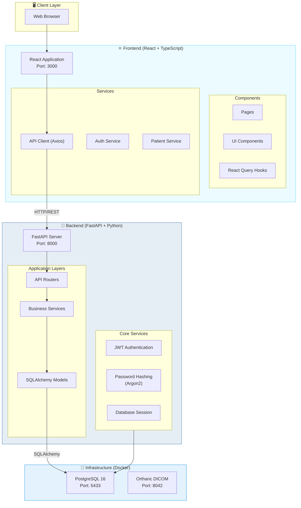
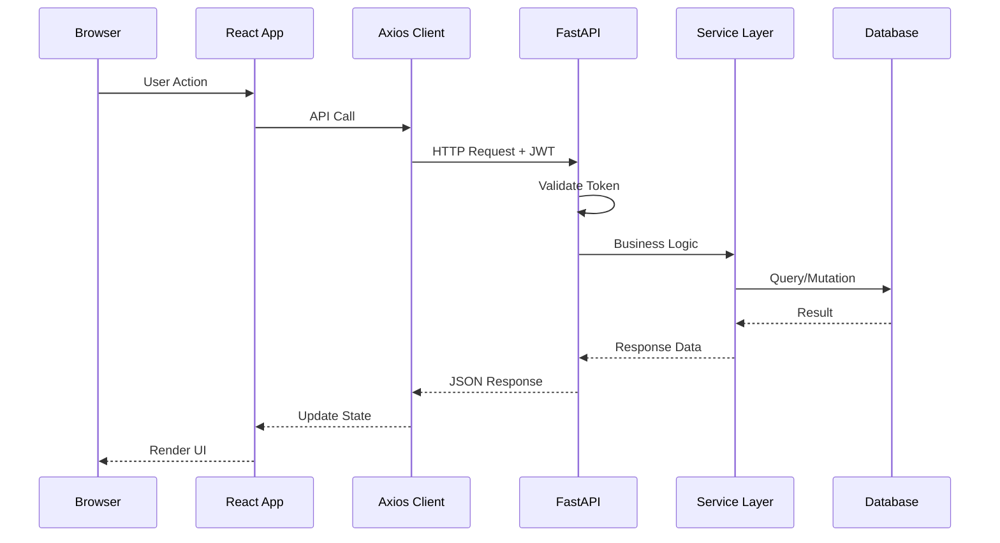

# EHR Application - System Architecture

## Overall Architecture

## Component Communication

## Technology Stack

| Layer | Technology | Purpose |
|-------|------------|---------|
| **Frontend** | React 18 | UI Framework |
| | TypeScript | Type Safety |
| | Ant Design 5 | UI Component Library |
| | React Query | Server State Management |
| | Axios | HTTP Client |
| | React Router 6 | Client-side Routing |
| **Backend** | FastAPI | REST API Framework |
| | Python 3.11+ | Programming Language |
| | SQLAlchemy 2.0 | ORM |
| | Pydantic 2.0 | Data Validation |
| | Alembic | Database Migrations |
| | Argon2 | Password Hashing |
| | PyJWT | JSON Web Tokens |
| **Database** | PostgreSQL 16 | Primary Database |
| **DICOM** | Orthanc | Medical Imaging Server |
| **DevOps** | Docker Compose | Container Orchestration |

## Port Mapping

| Service | Port | Description |
|---------|------|-------------|
| Frontend (Vite) | 3000 | React Development Server |
| Backend (FastAPI) | 8000 | API Server |
| PostgreSQL | 5433 | Database (mapped from 5432) |
| Orthanc HTTP | 8042 | DICOM Web Interface |
| Orthanc DICOM | 4242 | DICOM Protocol |

---

*Last Updated: January 31, 2026*
