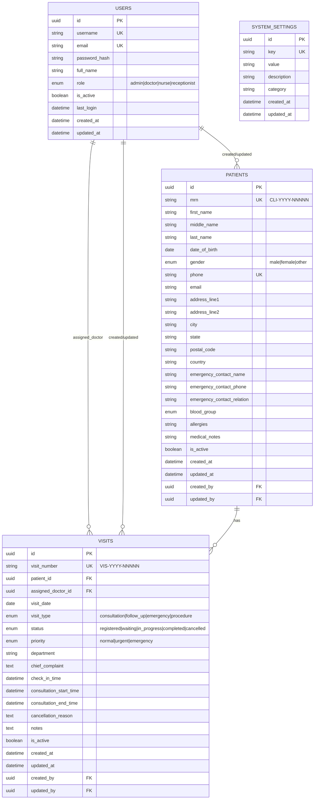

# EHR Application - Database Schema

## Entity Relationship Diagram

## Phase Implementation Status

| Entity | Phase | Status |
|--------|-------|--------|
| USERS | 1B, 1C | ✅ Complete |
| PATIENTS | 1D | ✅ Complete |
| SYSTEM_SETTINGS | 2A | 📋 Planned |
| VISITS | 2A | 📋 Planned |

## Table Indexes

### users
- `ix_users_username` (unique)
- `ix_users_email` (unique)
- `ix_users_role`
- `ix_users_is_active`

### patients
- `ix_patients_mrn` (unique)
- `ix_patients_phone` (unique)
- `ix_patients_last_name`
- `ix_patients_is_active`

### visits (Planned - Phase 2A)
- `ix_visits_visit_number` (unique)
- `ix_visits_patient_id`
- `ix_visits_assigned_doctor_id`
- `ix_visits_visit_date`
- `ix_visits_status`

## MRN/Visit Number Formats

| Type | Format | Example | Resets |
|------|--------|---------|--------|
| Patient MRN | CLI-YYYY-NNNNN | CLI-2026-00001 | Yearly |
| Visit Number | VIS-YYYY-NNNNN | VIS-2026-00042 | Yearly |

---

*Last Updated: January 31, 2026*
