# EHR Application - Frontend Structure

## Component Hierarchy


## Directory Structure

```
frontend/src/
├── App.tsx                 # Main app with routing
├── main.tsx               # Entry point
├── index.css              # Global styles
│
├── assets/                # Static assets (images, icons)
│
├── components/            # Reusable UI components
│   ├── auth/
│   │   ├── ProtectedRoute.tsx
│   │   └── LoginForm.tsx
│   ├── common/
│   │   ├── LoadingSpinner.tsx
│   │   ├── StatusBadge.tsx
│   │   └── ConfirmModal.tsx
│   └── layout/
│       ├── MainLayout.tsx
│       ├── Sidebar.tsx
│       ├── Header.tsx
│       └── PageHeader.tsx
│
├── config/                # Configuration
│   └── constants.ts       # App constants
│
├── contexts/              # React contexts
│   └── AuthContext.tsx    # Authentication state
│
├── hooks/                 # Custom React hooks
│   ├── useAuth.ts
│   ├── usePatients.ts
│   └── useVisits.ts       # (Phase 2)
│
├── pages/                 # Route pages
│   ├── Login.tsx
│   ├── Dashboard.tsx
│   ├── patients/
│   │   ├── PatientList.tsx
│   │   ├── PatientCreate.tsx
│   │   ├── PatientDetail.tsx
│   │   └── PatientEdit.tsx
│   └── visits/            # (Phase 2)
│       ├── VisitList.tsx
│       ├── VisitCreate.tsx
│       ├── VisitDetail.tsx
│       └── VisitEdit.tsx
│
├── services/              # API service layer
│   ├── api.ts             # Axios client setup
│   ├── authService.ts
│   ├── patientService.ts
│   └── visitService.ts    # (Phase 2)
│
├── theme/                 # Ant Design theme
│   └── index.ts           # Theme configuration
│
├── types/                 # TypeScript types
│   ├── auth.ts
│   ├── patient.ts
│   ├── common.ts
│   └── visit.ts           # (Phase 2)
│
└── utils/                 # Utility functions
    ├── formatters.ts      # Date/number formatting
    └── validators.ts      # Form validation
```

## Page Routing

```mermaid
flowchart LR
    subgraph Public["Public Routes"]
        LoginRoute["/login → Login.tsx"]
    end

    subgraph Protected["Protected Routes (Auth Required)"]
        DashRoute["/ → Dashboard.tsx"]
        
        subgraph PatientRoutes["/patients/*"]
            PList["/patients → PatientList"]
            PCreate["/patients/create → PatientCreate"]
            PDetail["/patients/:id → PatientDetail"]
            PEdit["/patients/:id/edit → PatientEdit"]
        end

        subgraph VisitRoutes["/visits/* (Phase 2)"]
            VList["/visits → VisitList"]
            VCreate["/visits/create → VisitCreate"]
            VDetail["/visits/:id → VisitDetail"]
            VEdit["/visits/:id/edit → VisitEdit"]
        end
    end

    style Public fill:#ffcccc
    style Protected fill:#ccffcc
```



## Data Flow


## Phase Implementation Status

| Component Category | Phase | Status |
|--------------------|-------|--------|
| App.tsx, Routing | 1E | ✅ |
| AuthContext | 1E | ✅ |
| MainLayout, Sidebar | 1E | ✅ |
| Login page | 1F | ✅ |
| Patient pages | 1G | ✅ |
| Patient hooks & service | 1G | ✅ |
| Visit pages | 2D, 2E | 📋 Planned |
| Visit hooks & service | 2C | 📋 Planned |
| Dashboard widgets | 2F | 📋 Planned |

---

*Last Updated: January 31, 2026*
