# Phase 1C/1F: Authentication Flow

## Login Flow

## Token Refresh Flow

## Protected Route Flow

## Authorization (Role-Based)

```mermaid
flowchart LR
    subgraph Roles["User Roles"]
        Admin["👑 Admin"]
        Doctor["🩺 Doctor"]
        Nurse["💉 Nurse"]
        Receptionist["📋 Receptionist"]
    end

    subgraph Permissions["Permissions"]
        UserMgmt["User Management"]
        PatientFull["Patient CRUD"]
        PatientView["Patient View"]
        VisitMgmt["Visit Management"]
    end

    Admin --> UserMgmt
    Admin --> PatientFull
    Admin --> VisitMgmt
    
    Doctor --> PatientFull
    Doctor --> VisitMgmt
    
    Nurse --> PatientFull
    Nurse --> VisitMgmt
    
    Receptionist --> PatientFull
    Receptionist --> VisitMgmt
```

## JWT Token Structure

## Component Relationships

## Backend Auth Components

---

*Last Updated: January 31, 2026*
