# Phase 1A/1B: Infrastructure & Backend Structure

## Docker Infrastructure (Phase 1A)

```mermaid
flowchart TB
    subgraph Host["🖥️ Host Machine"]
        subgraph DockerCompose["docker-compose.yml"]
            subgraph Network["ehr_network (bridge)"]
                PG["🐘 ehr_postgres<br/>PostgreSQL 16<br/>Port: 5433:5432"]
                Orthanc["🏥 ehr_orthanc<br/>Orthanc DICOM<br/>Ports: 8042, 4242"]
            end
        end
        
        subgraph Volumes["Persistent Volumes"]
            PGData["postgres_data"]
            OrthancData["orthanc_data"]
        end

        subgraph DevEnvironment["Development Environment"]
            Backend["Backend (venv)<br/>Python 3.11+<br/>Port: 8000"]
            Frontend["Frontend (node)<br/>Node.js 18+<br/>Port: 3000"]
        end
    end

    PG --> PGData
    Orthanc --> OrthancData
    Backend -->|"SQLAlchemy"| PG
    Frontend -->|"HTTP"| Backend

    style DockerCompose fill:#2496ed20,stroke:#2496ed
    style DevEnvironment fill:#4caf5020,stroke:#4caf50
```

## Backend Code Structure (Phase 1B)

## File Responsibilities

### Core (`app/core/`)

| File | Purpose | Phase |
|------|---------|-------|
| `config.py` | Environment variables, database URL, JWT settings | 1B |
| `database.py` | SQLAlchemy engine, session factory, get_db dependency | 1B |
| `security.py` | Password hashing (Argon2), JWT encode/decode | 1C |

### Models (`app/models/`)

| File | Purpose | Phase |
|------|---------|-------|
| `base.py` | Base class with id, timestamps, is_active | 1B |
| `user.py` | User model with role enum | 1C |
| `patient.py` | Patient model with MRN, demographics | 1D |

### API (`app/api/v1/`)

| File | Purpose | Phase |
|------|---------|-------|
| `auth.py` | Login, logout, me, refresh endpoints | 1C |
| `users.py` | User CRUD (admin only) | 1C |
| `patients.py` | Patient CRUD, search, MRN lookup | 1D |

## Development Scripts

---

*Last Updated: January 31, 2026*
