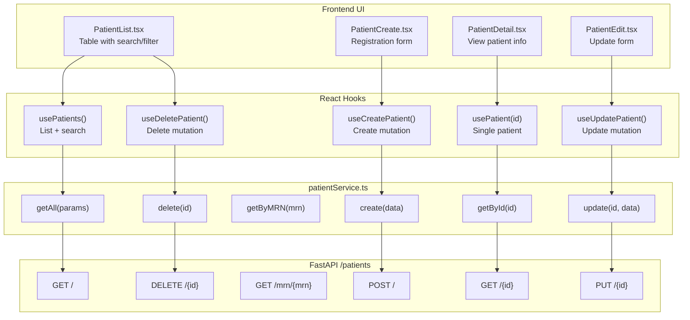
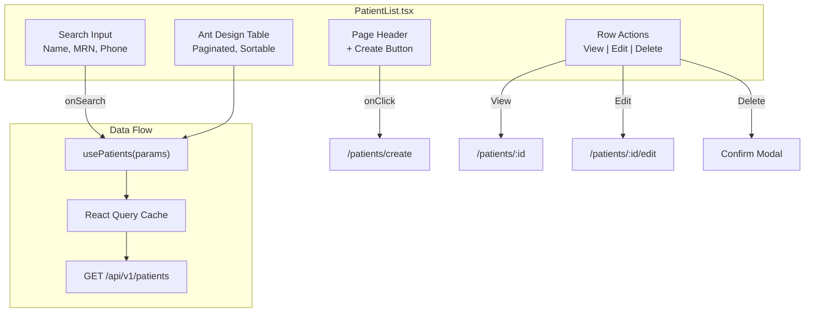
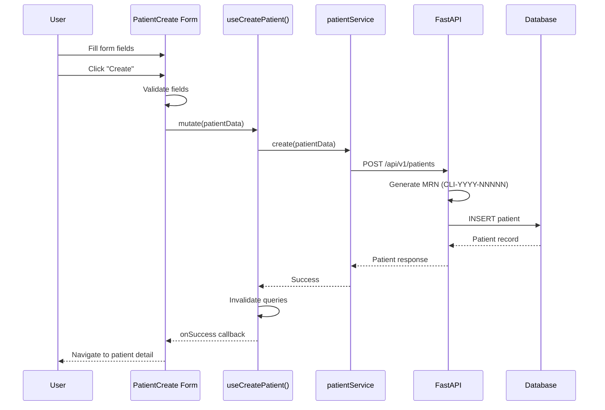
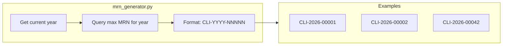
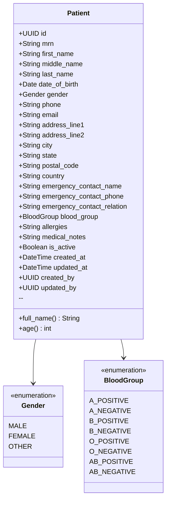
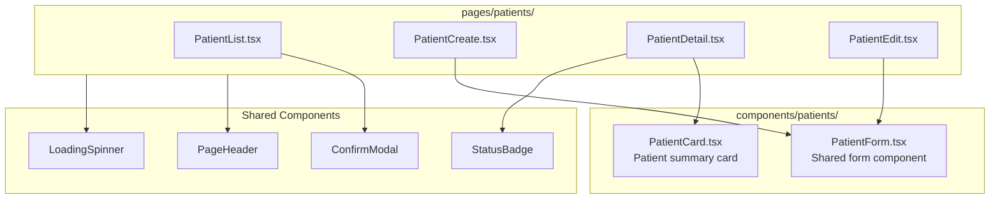
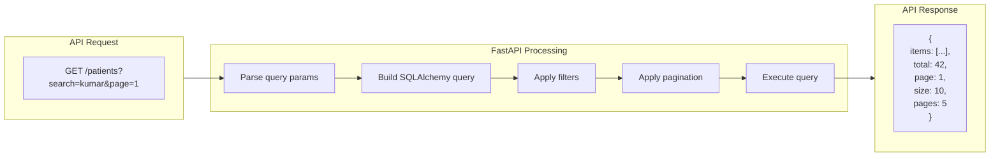

# Phase 1D/1G: Patient Module

## Patient CRUD Flow

## Patient List Page

## Patient Create Flow

## MRN Generation

## Patient Data Model

## Component Hierarchy

## API Response Flow

---

*Last Updated: January 31, 2026*
