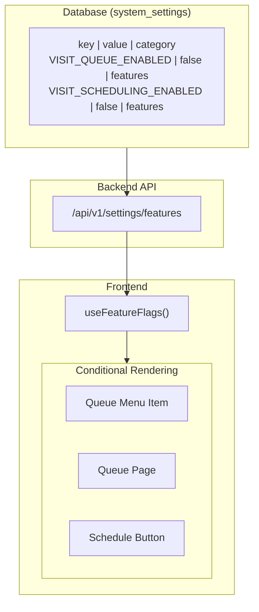
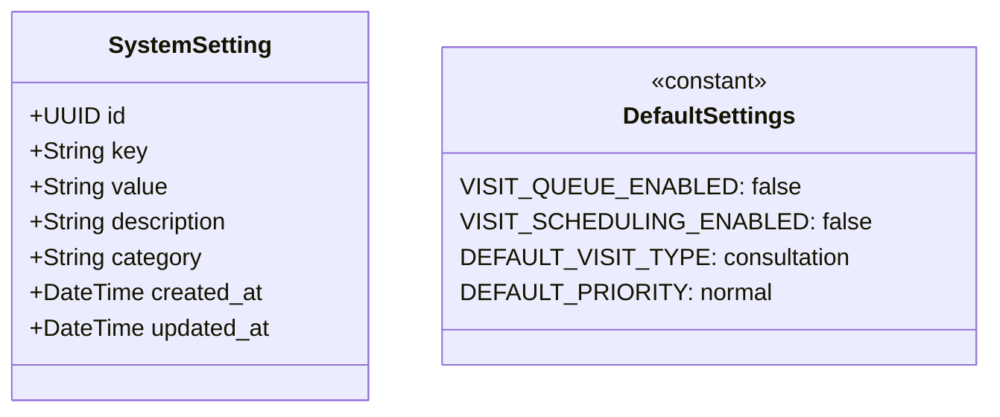
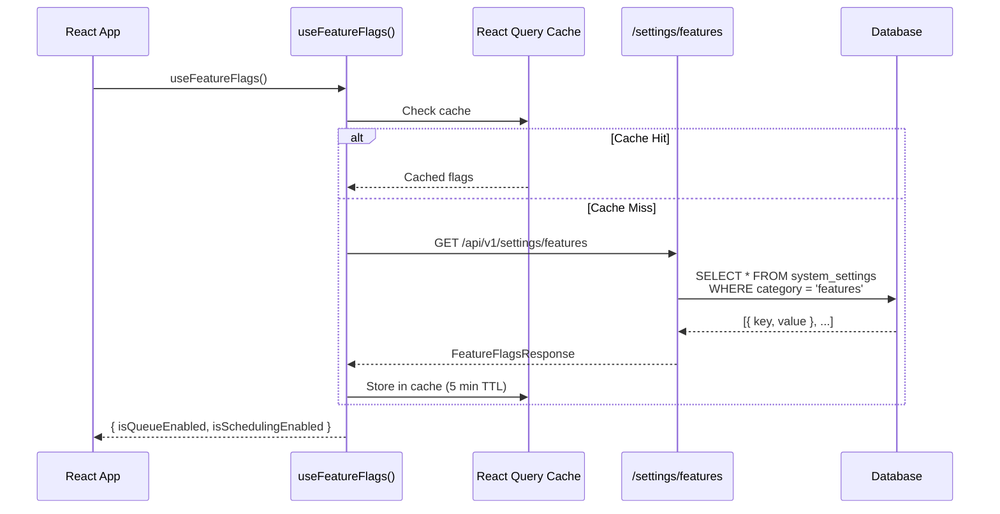
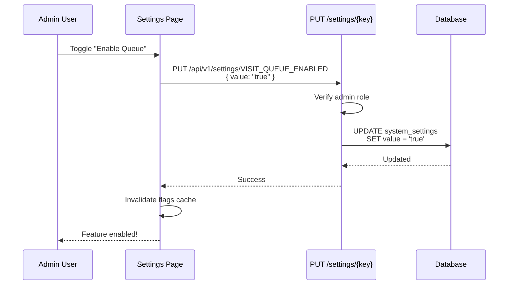

# Feature Flags System

## Overview



## SystemSetting Model



## Feature Flag Flow



## Conditional Rendering

```tsx
// Frontend usage pattern

function Sidebar() {
  const { isQueueEnabled } = useFeatureFlags();

  return (
    <Menu>
      <Menu.Item key="dashboard">Dashboard</Menu.Item>
      <Menu.Item key="patients">Patients</Menu.Item>
      
      <Menu.SubMenu key="visits" title="Visits">
        <Menu.Item key="visits-list">All Visits</Menu.Item>
        <Menu.Item key="visits-create">New Visit</Menu.Item>
        
        {/* Only show when Queue feature is enabled */}
        {isQueueEnabled && (
          <Menu.Item key="visits-queue">
            Today's Queue
          </Menu.Item>
        )}
      </Menu.SubMenu>
    </Menu>
  );
}
```

## Default Flags (OFF)

| Flag | Default | When Enabled |
|------|---------|--------------|
| `VISIT_QUEUE_ENABLED` | `false` | Shows queue menu, queue page, real-time updates |
| `VISIT_SCHEDULING_ENABLED` | `false` | Allows future date booking, shows calendar |

## Admin API



## Category Groupings

| Category | Purpose | Example Keys |
|----------|---------|--------------|
| `features` | Toggle UI features | VISIT_QUEUE_ENABLED |
| `defaults` | Default values | DEFAULT_VISIT_TYPE |
| `limits` | System limits | MAX_VISITS_PER_DAY |
| `display` | UI settings | DATE_FORMAT |

## Security

- **Read**: All authenticated users can read feature flags
- **Write**: Only admin users can modify settings
- **Cache**: Frontend caches for 5 minutes to reduce API calls

---

*Last Updated: January 31, 2026*
