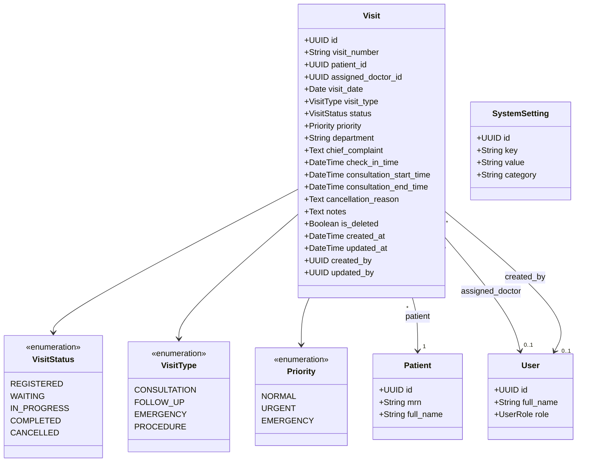
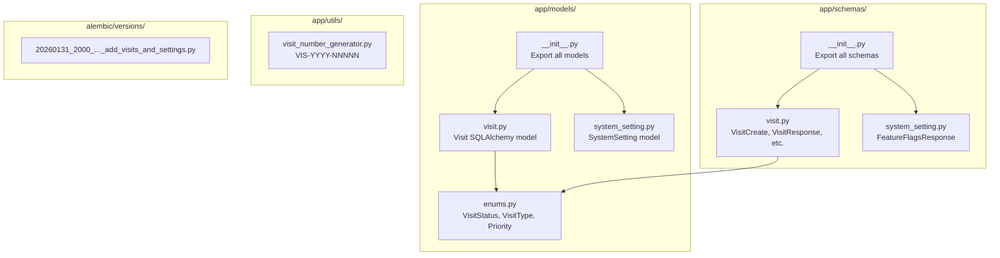
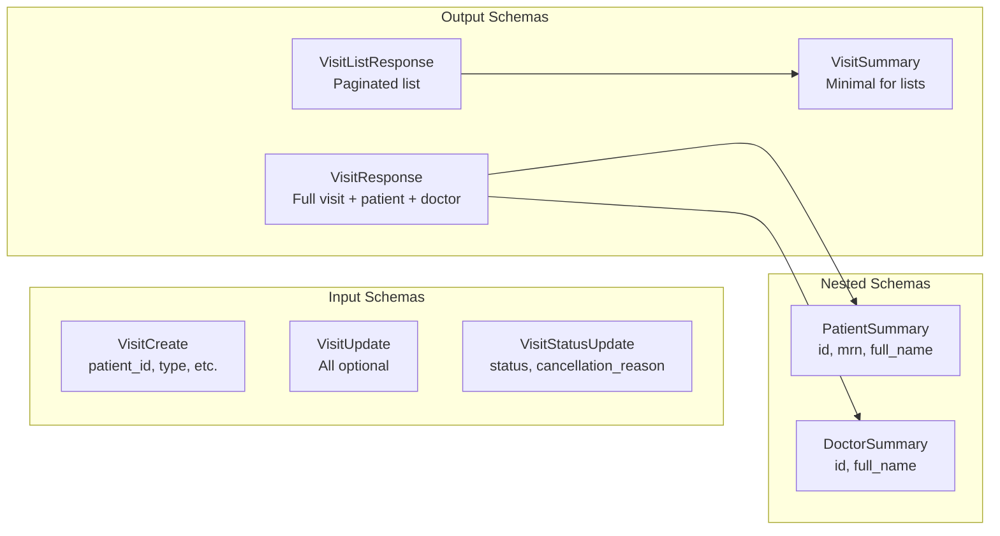
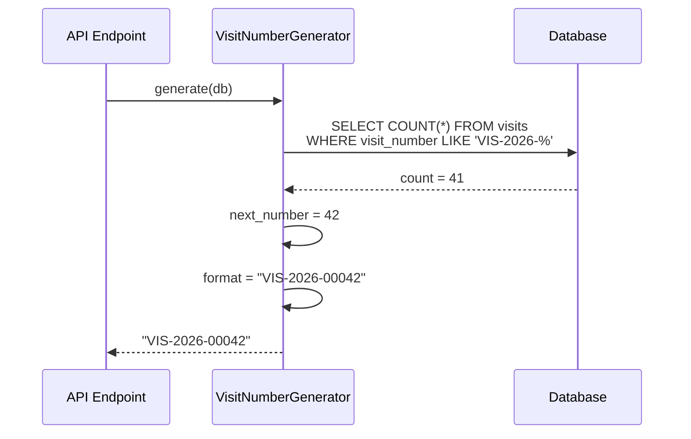

# Phase 2A: Visit Module Architecture

## Visit Data Model

## Backend File Structure (Phase 2A)

## Schema Relationships

## Visit Number Generation

## Files Created in Phase 2A

| File | Purpose | Lines |
|------|---------|-------|
| `app/models/enums.py` | Visit status, type, priority enums | ~80 |
| `app/models/visit.py` | Visit SQLAlchemy model | ~200 |
| `app/models/system_setting.py` | SystemSetting model | ~100 |
| `app/schemas/visit.py` | Visit Pydantic schemas | ~230 |
| `app/schemas/system_setting.py` | Setting schemas | ~80 |
| `app/utils/visit_number_generator.py` | Visit number generator | ~130 |
| `alembic/versions/..._add_visits_and_settings.py` | Database migration | ~150 |

---

*Last Updated: January 31, 2026*
