# Visit Status Flow

## State Machine Diagram


## Status Transition Rules

```mermaid
flowchart TB
    subgraph Allowed["✅ Allowed Transitions"]
        R1["REGISTERED → WAITING"]
        R2["REGISTERED → CANCELLED"]
        W1["WAITING → IN_PROGRESS"]
        W2["WAITING → CANCELLED"]
        I1["IN_PROGRESS → COMPLETED"]
        I2["IN_PROGRESS → CANCELLED"]
    end

    subgraph Blocked["❌ Blocked Transitions"]
        B1["COMPLETED → Any"]
        B2["CANCELLED → Any"]
        B3["WAITING → REGISTERED"]
        B4["IN_PROGRESS → WAITING"]
        B5["Any → REGISTERED"]
    end

    style Allowed fill:#d4edda
    style Blocked fill:#f8d7da
```



## Transition Validation Code

```python
# From app/models/enums.py

ALLOWED_STATUS_TRANSITIONS = {
    VisitStatus.REGISTERED: [VisitStatus.WAITING, VisitStatus.CANCELLED],
    VisitStatus.WAITING: [VisitStatus.IN_PROGRESS, VisitStatus.CANCELLED],
    VisitStatus.IN_PROGRESS: [VisitStatus.COMPLETED, VisitStatus.CANCELLED],
    VisitStatus.COMPLETED: [],  # Terminal state
    VisitStatus.CANCELLED: [],  # Terminal state
}

# Usage in service layer:
def validate_status_transition(current: VisitStatus, new: VisitStatus) -> bool:
    allowed = ALLOWED_STATUS_TRANSITIONS.get(current, [])
    return new in allowed
```

## Status Change Flow

```mermaid
sequenceDiagram
    participant UI as Frontend
    participant API as /visits/{id}/status
    participant Svc as VisitService
    participant DB as Database

    UI->>API: PATCH { status: "waiting" }
    API->>Svc: update_status(id, new_status)
    Svc->>DB: Get current visit
    DB-->>Svc: Visit { status: "registered" }
    Svc->>Svc: Validate transition<br/>registered → waiting ✅
    
    alt Transition Allowed
        Svc->>Svc: Update timestamps
        Svc->>DB: UPDATE status, check_in_time
        DB-->>Svc: Updated visit
        Svc-->>API: VisitResponse
        API-->>UI: 200 OK
    else Transition Blocked
        Svc-->>API: ValidationError
        API-->>UI: 400 Bad Request<br/>"Invalid status transition"
    end
```



## Timestamp Updates by Status

| Transition | Timestamp Updated |
|------------|-------------------|
| → REGISTERED | `created_at` (auto) |
| → WAITING | `check_in_time` |
| → IN_PROGRESS | `consultation_start_time` |
| → COMPLETED | `consultation_end_time` |
| → CANCELLED | (none, just `updated_at`) |

## Status Colors (UI)

| Status | Color | Hex | Icon |
|--------|-------|-----|------|
| REGISTERED | Blue | `#1890ff` | 📋 |
| WAITING | Orange | `#fa8c16` | ⏳ |
| IN_PROGRESS | Green | `#52c41a` | 🔄 |
| COMPLETED | Gray | `#8c8c8c` | ✅ |
| CANCELLED | Red | `#ff4d4f` | ❌ |

---

*Last Updated: January 31, 2026*
